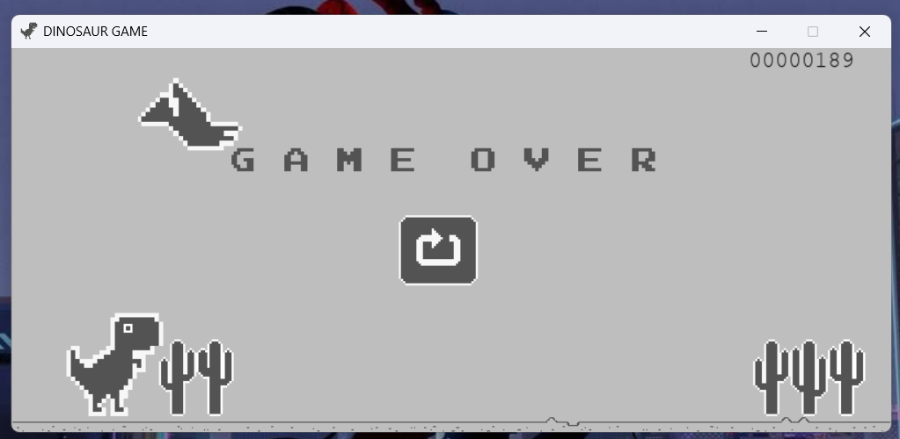

# Chrome Dinosaur Game (Pygame)

A Python recreation of the iconic Google Chrome offline T-Rex runner game built using Pygame. Jump over obstacles, dodge flying birds, and rack up the highest score possible!

--- 

## Preview

  

---

## Features

- **Endless Runner Gameplay:** Infinite scrolling track with real-time score tracking.
- **Dynamic Obstacle Spawning:** Spawns random cacti sizes and ambient background elements (clouds and flying birds).
- **Sprite Animations:** Features animated running and jumping mechanics for the dinosaur, along with wing-flapping animations for birds.
- **PyInstaller Compatibility:** Includes custom image loading helpers (`resource_path`) for seamless bundling into standalone `.exe` executables.

---

## Requirements
- **Python 3.x**
- **pygame library**
- **dino-assets**

---
